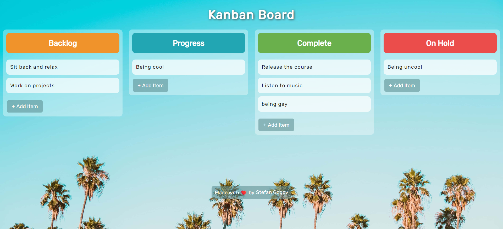
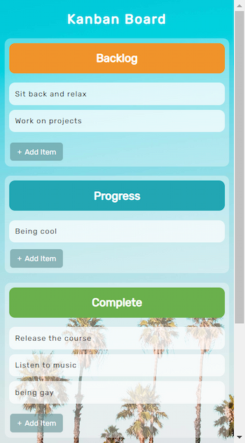

# 📝 Kanban Board

## 📖 About

Kanban Board is a web-based project management tool that allows users to organize their tasks into boards, lists, and cards. It uses a drag-and-drop interface to make it easy to move tasks between different stages of completion.

## 🔴 Live demo

To use Kanban Board, simply visit the [live demo](https://stekatag.github.io/kanban-board/) or download the source code and run it on your own web server.

## 🖥️ Desktop preview

## 📱 Mobile preview

## 🎉 Features

The Kanban Board has the following features:

- Multiple boards: Users can interact with multiple boards at the same time.
- Cards: Users can create cards with a title and description.
- Drag and drop: Users can drag and drop cards between lists.
- Save to local storage: Users board data is saved to local storage.

## 🤝 Contributing

If you would like to contribute to Kanban Board, please follow these steps:

1. Fork the repository and create a new branch for your changes.
2. Make your changes and test them thoroughly.
3. Submit a pull request to the main repository.

## ℹ️ Credits

Kanban Board was created by Stefan Gogov.

## 🪪 License

Distributed under the MIT License. See [license](https://github.com/stekatag/kanban-board/blob/master/LICENSE) for more information.
